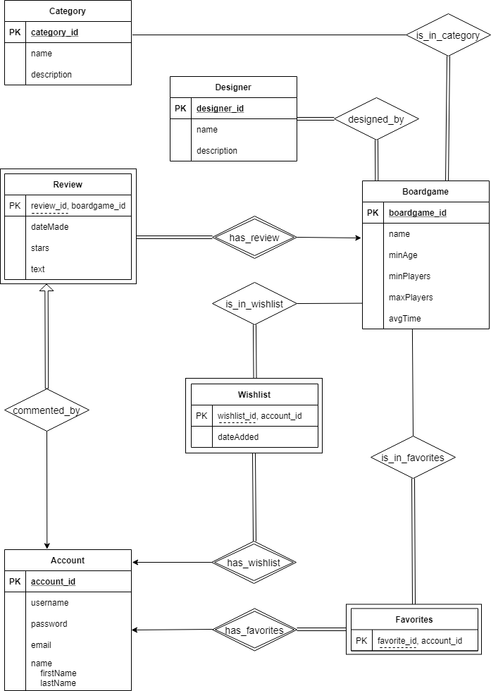

# Boardgame-Database

For this project, I intend to design a board game database that acts as a place for users to reference for games they’ve played, games they would like to play, and basically form the basis for a nice social media environment.

### Entities included
-	Account: holds account information of a user (password will be hashed in the front-end)
-	Boardgame: holds basic information about a boardgame
-	Category: general method for dividing up the boardgames into genres
-	Designer: a list of designers associated with boardgames in the database
-	Review: users can leave reviews on a boardgame with a rating and message
-	Designed_By: a relation that contains information about which designer has designed what boardgame
-	In Category: a relation that contains information about what boardgame is in what category.

### Design expectations/limitations created for this database:
-	Accounts can only make one review per boardgame. This is to limit how much one person can affect the average rating of a boardgame. They can also have their own wish list and favorites list filled with boardgames within the database.
-	Boardgames must be designed by a designer(s) and must be categorized in at least one category.
-	Any category can have as many boardgames within it.
-	Designers can only exist within the database if they have designed a boardgame.
-	A review is dependent on a boardgame and must have be made by an account.
-	Wishlist is dependent on an account. Any tuple in Wishlist can only be associated with one account, but an account can have many boardgames in their Wishlist. Any tuple in Wishlist must also have a boardgame associated with it.
-	Favorites is also dependent on an account with the same restrictions as Wishlist. 

### Entity-Relation Diagram
